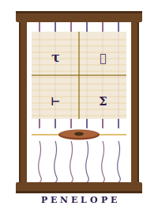

# Penelope

<p align="center">
  
</p>

> *Tesse e disfa la tela delle tue metriche — ma il telaio è tipato.*

Verifiable Grafana dashboards in Agda — geometria (slicing floorplan) e
decorazione (panel Grafana) separate, datasource **per-panel** (Prometheus
via HenQL, Loki/Elastic via Loquel), variabili condivise tra backend con
ben-formazione a tempo di tipo.

---

## Il problema

Una dashboard Grafana è un file JSON di parecchie centinaia di righe. Ogni
panel ha un `type` (`timeseries`, `stat`, `gauge`, `bargauge`, `table`,
`status-history`), un `datasource` (Prometheus, Loki, Elastic, …) e una
lista di `targets` con espressioni nel linguaggio di quel backend. **Niente
garantisce che il tipo del panel sia compatibile con il tipo della query**:
un panel `stat` con una `rate(...)[5m]` come target è un errore silenzioso,
scoperto solo quando Grafana mostra il vuoto.

E la disposizione? `gridPos` è un quartetto `(x, y, w, h)` libero. Due
panel possono sovrapporsi, scappare dal canvas, lasciare buchi. Tutto JSON
sintatticamente valido, tutto rotto a livello visivo.

E le variabili? Grafana le sostituisce a runtime nelle query con un
sentinella `$nome` — ma nulla impedisce a due panel di referenziare la
stessa `env` con flag `multi` divergenti (uno `=`, l'altro `=~`), o di
puntare a campi diversi: il JSON resta valido, il selettore in alto si
rompe in silenzio.

---

## Come funziona

Penelope codifica entrambi i vincoli **nella struttura dei tipi**. Nessuna
prova `.proof` attaccata: le regole sono nello shape.

### Il panel kind determina il QueryType — non lo *vincola*, lo *è*

```agda
data PanelKind : Set where
  TimeSeries Stat Gauge BarGauge Table StatusHistory : PanelKind
```

Quale `QueryType` esige un dato kind è una proprietà del **backend** (il
mapping può essere diverso fra Prometheus e Loquel). Penelope astrae i
backend dietro una record `QueryLang`:

```agda
record QueryLang : Set₂ where
  field
    Ctx         : Set₁
    QueryType   : Set
    Query       : Ctx → QueryType → Set
    queryTypeOf : PanelKind → QueryType
```

E ogni backend istanzia la propria `queryTypeOf`:

```agda
-- HenQL/Prometheus
henqlQueryTypeOf TimeSeries    = InstantVector
henqlQueryTypeOf Stat          = Scalar
henqlQueryTypeOf Gauge         = Scalar
henqlQueryTypeOf BarGauge      = Scalar
henqlQueryTypeOf Table         = InstantVector
henqlQueryTypeOf StatusHistory = InstantVector

-- Loquel (Loki/Elastic): scalarM / rangeM / logStream
loquelQueryTypeOf Stat          = scalarM
loquelQueryTypeOf TimeSeries    = rangeM
loquelQueryTypeOf StatusHistory = rangeM
loquelQueryTypeOf Table         = logStream
-- …
```

Un `Panel` si indicizza sul **datasource** (non sul model) e sul kind:

```agda
record Panel (ds : Datasource) (k : PanelKind) : Set where
  field
    title   : String
    targets : List⁺ (Target ds k)
    vars    : List Variable
```

Il campo `targets` ospita una lista **non vuota** di `Target ds k`. Ogni
target porta una query nel `QueryLang` del datasource, sul `Ctx`
corretto, con il `QueryType` imposto dal kind — più una prova booleana di
fedeltà al frammento (`ok : T (faithful? ds query)`). Una query fuori dal
frammento fedele del backend NON typeckecka.

### Datasource per-panel: Prometheus, Loki, Elastic nella stessa tela

In Grafana il datasource è **per-panel**. Penelope segue: `Datasource` è
una record opaca con `lang : QueryLang`, `ctx`, `grafanaType`, `render`,
`faithful?`. Ogni backend espone fabbriche:

```agda
prometheus : Model  → Datasource           -- HenQL, "prometheus"
loki       : Schema → Datasource           -- Loquel, "loki"
elastic    : Schema → Datasource           -- Loquel, "elasticsearch"
```

Il tipo esistenziale `AnyPanel : Set₂` impacchetta `(ds, kind, Panel ds
kind)`. La tela porta `AnyPanel` come contenuto: **panel di backend
diversi coesistono nella stessa dashboard** senza che la geometria sappia
nulla di Grafana.

### Due livelli: geometria content-polimorfa + decorazione che istanzia

**Livello geometrico** (`Penelope.Tiling`) — completamente indipendente
da Grafana. Tiling è parametrico su un contenuto astratto `C : Set ℓ`,
mai sul `Model` né sul `Datasource`: `tile : C → Tiling C x y w h`.
Niente import di `Penelope.Panel` / `HenQL.Syntax` / `Loquel.*`.

```agda
data Tiling {ℓ} (C : Set ℓ) : (x y w h : ℕ) → Set ℓ where
  tile : ∀ {x y w h} → C → Tiling C x y w h
  hcut : ∀ {x y w} {ht hb : ℕ}
       → Tiling C x y w (suc ht)
       → Tiling C x (y + suc ht) w (suc hb)
       → Tiling C x y w (suc ht + suc hb)
  vcut : ∀ {x y h} {wl wr : ℕ}
       → Tiling C x y (suc wl) h
       → Tiling C (x + suc wl) y (suc wr) h
       → Tiling C x y (suc wl + suc wr) h
```

Le sotto-dimensioni dei figli sono `suc`-indicizzate, quindi **min-size
≥ 1 è definizionale**: nessuna cella può avere `w = 0` o `h = 0`.

**Classe coperta**: gli **slicing floorplan** (partizioni guillotine).
Il pinwheel a 5 rettangoli non è esprimibile — limitazione strutturale.

I lemmi sono dimostrati **una volta** nel modulo `Tiling`, universali su `C`:

```agda
contained : (t : Tiling C x y w h) (l : Leaf t) → place t l ⊆ mkRect x y w h
disjoint  : (t : Tiling C x y w h) (l₁ l₂ : Leaf t)
          → l₁ ≢ l₂ → Disjoint (place t l₁) (place t l₂)
```

`Tiling` vive in `Set ℓ` per ogni `ℓ`, quindi può ospitare `AnyPanel :
Set₂` senza inflazioni di universi.

**Livello decorazione** (`Penelope.Dashboard`) — istanzia `C := AnyPanel`.
La coerenza fra panel↔query↔datasource vive nel singolo `AnyPanel`, non
nella geometria. La coerenza fra panel diversi (variabili condivise) vive
in `Dashboard` come campo di ben-formazione:

```agda
record Dashboard : Set₂ where
  field
    title uid  : String
    variables  : List Variable
    viewport   : Rect
    tiling     : TilingOf AnyPanel viewport
    wf         : T (varsConsistentB
                     (collectPanelVars tiling ++ variables))
```

`wf` è implicito nel smart constructor `mkDashboard`: si risolve a `tt`
quando la lista delle variabili (quelle raccolte dai panel + quelle extra)
è coerente per nome. Due `env` con `multi` divergenti, o con `fld`
diversi, fanno ridurre `varsConsistentB` a `false` → `T false ≡ ⊥`:
typecheck fail.

Il renderer deriva i `gridPos` dagli implicit del tile, è totale, e i
gridPos emessi sono validi **per costruzione**:

```agda
renderDashboard : Dashboard → String
```

---

## La metafora

Penelope, moglie di Ulisse, **tesse di giorno la tela funebre per Laerte
e la disfa di notte** — per ingannare i pretendenti fino al ritorno del
marito. Le metriche funzionano allo stesso modo: una dashboard non è mai
*finita*, si riscrive ogni volta che il sistema cambia, si rifà ogni volta
che ti serve guardare qualcos'altro. Penelope non si lamenta del
rifacimento — **lo verifica**. Ogni rifacimento è una nuova tela tessuta,
e il telaio (il typechecker) garantisce che ogni filo abbia il tipo
giusto prima ancora che la tela esca dal subbio.

| Penelope             | Grafana / Agda                                       |
|----------------------|------------------------------------------------------|
| la tela              | `Tiling x y w h`, il tassellamento guillotine        |
| il filo              | un singolo `Panel ds k`                              |
| il subbio            | il `Datasource` che orienta i fili (per-panel)       |
| il telaio            | il typechecker Agda                                  |
| `tile`               | una cella foglia                                     |
| `hcut`               | taglio orizzontale: top sopra bottom                 |
| `vcut`               | taglio verticale: left accanto a right               |
| `queryTypeOf k`      | il tipo del filo imposto dal panel kind              |
| `$service` / `$env`  | la spola — passa fra fili diversi, lo stesso valore  |
| il pretendente       | una query non tipata che entrerebbe a runtime        |
| disfare la tela      | ri-editare il modulo, ri-typeckeckare                |
| Ulisse che torna     | il deploy di Grafana — la tela esce dal telaio       |

> *Una dashboard senza tipi è una tela che Penelope, al risveglio, non
> riconoscerebbe più.*

---

## Come libreria

```nix
# flake.nix del tuo progetto
inputs.penelope.url = "github:avit-io/penelope";
inputs.penelope.inputs.nixpkgs.follows = "nixpkgs";
inputs.penelope.inputs.piforge.follows = "piforge";

devShells.x86_64-linux.default =
  inputs.penelope.lib.mkShell {
    pkgs = nixpkgs.legacyPackages.x86_64-linux;
  };
```

```
# mio-progetto.agda-lib
name: mio-progetto
include: .
depend: standard-library prometea henql loquel penelope
```

```agda
open import Prometea.Core
open import HenQL.Syntax
open import Penelope.Panel
open import Penelope.Datasource
open import Penelope.Backend.Prometheus
open import Penelope.Tiling
open import Penelope.Dashboard
open import Penelope.JSON
open import Penelope.Sugar     -- timeseries/stat/... · □_ · ↕/↔

miaApp : Model
miaApp = record { Time = ℕ ; Val = Float ; Series = String }

promApp : Datasource
promApp = prometheus miaApp

errori : Panel promApp TimeSeries
errori = timeseries "Errori / s"
  (sumBy ("job" ∷ []) (rate (range "http_requests_errors_total" [] 5)))

latenza : Panel promApp TimeSeries
latenza = timeseries "Latenza"
  (rate (range "http_request_duration_seconds_sum" [] 5))

budget : Panel promApp Stat
budget = stat "Budget consumato" (scalar "0.42")

-- Geometria con payload: tile carica direttamente l'AnyPanel.
viewport : Rect
viewport = mkRect 0 0 24 16

tela : TilingOf AnyPanel viewport
tela = (left ↔ right) ↕ bot
  where
    left  : Tiling AnyPanel 0 0 12 8
    left  = tile (□ errori)
    right : Tiling AnyPanel 12 0 12 8
    right = tile (□ latenza)
    bot   : Tiling AnyPanel 0 8 24 8
    bot   = tile (□ budget)

salute : Dashboard
salute = mkDashboard "Salute API" "salute-api" [] viewport tela

-- renderDashboard salute : String — Grafana JSON pronto.
```

### Dashboard mista (Prometheus + Loki + Elastic)

Lo stesso `Tiling AnyPanel` può ospitare panel di backend diversi:

```agda
open import Penelope.Backend.Prometheus  using (prometheus)
open import Penelope.Backend.Loquel      using (loki; elastic; logT)
open import Loquel.Pipe                  using (Pipe; filterp)

promDS    : Datasource ; promDS    = prometheus miaApp
lokiDS    : Datasource ; lokiDS    = loki    appSchema
elasticDS : Datasource ; elasticDS = elastic appSchema

budget   : Panel promDS    Stat       ; budget   = stat ...
logTable : Panel lokiDS    Table      ; logTable = mkPanel1 ... (logT pipe)
search   : Panel elasticDS TimeSeries ; search   = ...

tela : TilingOf AnyPanel viewport
tela = tile (□ budget) ↔ tile (□ logTable) ↔ tile (□ search)
```

Ogni datasource porta il proprio `render` e il proprio `faithful?`: una
pipe Loquel fuori dal frammento LogQL può comunque essere fedele a
Elastic, e viceversa. La fedeltà è valutata **per panel sul datasource di
quel panel** — esempi reali in `Examples/TelaMista.agda` e
`Examples/TelaMulti.agda`.

### Template variables

`Variable` è il riferimento backend-agnostico. Due forme:

```agda
data VarSpec : Set where
  customSpec : List⁺ String → VarSpec                   -- lista di valori
  querySpec  : (sourceGrafanaType fld : String)
             → (multi includeAll : Bool) → VarSpec      -- terms su un campo

mkVariable      : String → List⁺ String → Variable               -- custom
mkQueryVariable : (name src fld : String) (multi inc : Bool) → Variable
varRef          : Variable → String                              -- "$name"
```

#### Custom — lista esplicita di valori

```agda
serviceVar : Variable
serviceVar = mkVariable "service"
  ("frontend" ∷ "backend" ∷ "api" ∷ [])

errori : Panel promApp TimeSeries
errori = timeseries "Errori / s"
  (rate (range
    ("http_requests_errors_total{service=\"" ++ varRef serviceVar ++ "\"}")
    [] 5))

salute = mkDashboard "Salute API" "salute-api" (serviceVar ∷ []) viewport tela
```

#### Tipizzata via Loquel — `_==ᵛ_` su campi `.keyword`

Per i datasource Loquel (Loki / Elastic) la variabile può essere
**ancorata allo schema**: il record `Var s` porta la prova che il campo
esiste ed è un campo esatto (suffisso `.keyword`). Un riferimento a un
campo inesistente o di testo libero non typeckecka.

```agda
envVar : Var beSchema
envVar = mkVar "env" "Env.keyword" env∈ true true   -- multi=true, includeAll=true

esPipe : Pipe beSchema beSchema
esPipe = filterp (env∈ ==ᵛ envVar)   -- ⇒ `term: { "Env.keyword": "$env" }`

esPanel : Panel elasticDS TimeSeries
esPanel = record
  { title   = "Activity by env"
  ; targets = mkTarget (rangeT esPipe MCount [] "5m") nothing false tt ∷ []
  ; vars    = elasticVar envVar ∷ []          -- registrazione opaca
  }
```

`elasticVar` (o `lokiVar`) inietta `Var s` nella forma `Variable`
backend-agnostica: il datasource Grafana viene timbrato (`elasticsearch` /
`loki`), tutto il resto è derivato dal record.

#### Tipizzata via HenQL — `_=ᵛ_` come label matcher PromQL

In posizione di label matcher, una variabile produce un `Matcher` con la
semantica multi/all di PromQL:

```agda
healthMatchers : List (Matcher beModel)
healthMatchers =
    mkMatcher "SourceService" meq "BeAccounts"
  ∷ ("Env" =ᵛ envVar)                            -- multi=true ⇒ Env=~"$env"
  ∷ mkMatcher "Status"        meq "FAIL"
  ∷ []

panel47Expr =
  sumBy ("Name" ∷ [])
    (changes
      (rangeS "health_checks_count" healthMatchers "$__interval"))

-- → sum by (Name) (changes(
--     health_checks_count{SourceService="BeAccounts",Env=~"$env",Status="FAIL"}
--     [$__interval]))
```

`multi=true` ⇒ `=~` (Grafana sostituisce `v₁|v₂` con regex → disgiunzione
esatta). `multi=false` ⇒ `=` (uguaglianza esatta). `includeAll` non è nel
matcher: chi lo vuole usa `allValue=".*"` lato Grafana, o omette il
matcher.

#### Sharing cross-backend con ben-formazione

Una **stessa** `Variable` può essere referenziata da panel ES e da panel
Prometheus nella stessa dashboard. Il render walka la tela, raccoglie
`Panel.vars` da ogni panel, e dedupplica per nome → una sola voce nel
blocco `templating`.

Due dichiarazioni con lo stesso `name` ma `spec` divergenti (es. multi
discordante, o `fld` diverso) fanno ridurre `varsConsistentB` a `false`:
la dashboard **non typeckecka**. La negative case è documentata in
`Examples/TelaCondivisa.agda`.

#### `forEach` — binder locale

```agda
salute = forEach "service" ("frontend" ∷ "backend" ∷ []) λ service →
  mkDashboard "Salute API" "salute-api" [] viewport (tela-of service)
```

`forEach` pre-pende la variabile alla lista di dashboard; più `forEach`
in cascata le accumulano.

> Lo zucchero in `Penelope.Sugar` è interamente fatto di definizioni
> sull'algebra esistente (riducono a `mkPanel`, `hcut`, `vcut`, `□_`).
> Nessun nuovo data type, nessuna prova ulteriore: gli invarianti di
> `Tiling`, `Panel` e `Dashboard.wf` sono ereditati. Se volessi controllo
> fine, puoi ignorare `Sugar` e scrivere `mkPanel`/`hcut`/`vcut`
> direttamente.

### Come sviluppatore di Penelope

```bash
git clone https://github.com/avit-io/penelope
cd penelope
nix develop                            # Agda 2.8 + stdlib + prometea + henql + loquel
agda Penelope/JSON.agda                # typecheck completo
agda Examples/Tela.agda                # esempio base
agda Examples/TelaCondivisa.agda       # dashboard mista con var condivisa
```

---

## Struttura del progetto

```
penelope/
├── Penelope/
│   ├── Tiling.agda           # GEOMETRIA — Tiling (C : Set ℓ), Leaf, place,
│   │                         #   contained, disjoint (universe-polimorfo,
│   │                         #   zero import Grafana)
│   ├── Panel.agda            # PanelKind (TimeSeries/Stat/Gauge/BarGauge/
│   │                         #   Table/StatusHistory)
│   ├── Query.agda            # QueryLang — astrazione backend (Ctx,
│   │                         #   QueryType, Query, queryTypeOf)
│   ├── Datasource.agda       # Datasource — lang + ctx + grafanaType +
│   │                         #   render + faithful? (per-panel)
│   ├── Variable.agda         # Variable · VarSpec (custom/query) ·
│   │                         #   varsConsistentB · varRef
│   ├── Backend/
│   │   ├── Prometheus.agda   # HenQL adapter — prometheus M : Datasource,
│   │   │                     #   _=ᵛ_ label matcher (= / =~)
│   │   └── Loquel.agda       # Loquel adapter — loki/elastic : Schema → DS,
│   │                         #   Var s typed (.keyword), _==ᵛ_
│   ├── Dashboard.agda        # DECORAZIONE — Target/Panel/AnyPanel +
│   │                         #   Dashboard con wf su variabili
│   ├── JSON.agda             # renderDashboard — gridPos dal walk del Tiling
│   └── Sugar.agda            # ZUCCHERO — □_ · per-kind · ↕/↔ · Widget ·
│                             #   rows/cols n-ari · forEach
├── Examples/
│   ├── Tela.agda             # esempio base: 3 panel Prometheus
│   ├── TelaLog.agda          # Loquel: stessa pipe su Loki e su Elastic
│   ├── TelaMista.agda        # Prometheus + Loki nella stessa tela
│   ├── TelaMulti.agda        # multi-target per panel
│   ├── TelaVars.agda         # variabili tipate Loquel (_==ᵛ_)
│   ├── TelaPromVars.agda     # panel-47 PromQL con _=ᵛ_ e changes
│   ├── TelaCondivisa.agda    # UNA variabile env condivisa fra ES e Prom
│   ├── RED.agda              # RED — N servizi × (rate, errors, duration)
│   └── SLO.agda              # SLO — N servizi × (SLI, budget, burn, trend)
├── penelope.agda-lib         # depend: standard-library prometea henql loquel
└── flake.nix                 # packages.lib · lib.mkShell · devShells.default
```

Il flake espone:

| Output | Contenuto |
|---|---|
| `packages.lib` | la libreria Agda come derivazione Nix |
| `packages.default` | stesso di `lib` |
| `lib.mkShell` | devShell consumer con stdlib + prometea + henql + loquel + penelope |
| `devShells.default` | devShell per sviluppare Penelope stessa |

---

## Relazione con l'ecosistema

```
Prometea.Core               ← Model · PromType · Denote
HenQL.Syntax / HenQL.Print  ← Expr · Matcher · prettyExpr (PromQL backend)
Loquel.Schema / Loquel.Pipe ← Schema · Pipe · render LogQL / Elastic
     │
     ▼
Penelope.Query              ← QueryLang (Ctx, QueryType, Query, queryTypeOf)
Penelope.Datasource         ← Datasource (lang + ctx + grafanaType + render + faithful?)
Penelope.Panel              ← PanelKind (incl. StatusHistory)
Penelope.Variable           ← Variable · VarSpec (custom/query) · varsConsistentB
Penelope.Backend.Prometheus ← prometheus M : Datasource, _=ᵛ_ matcher
Penelope.Backend.Loquel     ← loki/elastic : Schema → DS, Var s, _==ᵛ_
Penelope.Tiling             ← Tiling (C : Set ℓ), content-polimorfo
Penelope.Dashboard          ← Target · Panel ds k · AnyPanel · Dashboard wf
Penelope.JSON               ← renderDashboard → Grafana JSON
Penelope.Sugar              ← □_ · per-kind · ↕/↔ · Widget · rows/cols · forEach
```

Penelope dipende da HenQL+Prometea per il backend Prometheus e da Loquel
per Loki/Elastic. Non sa nulla di Agdovana — sono progetti sorella che
consumano gli stessi tipi fondazionali per fini diversi (Agdovana → regole
di alerting, Penelope → dashboard).

---

## Garanzie strutturali

**Nessuna prova attaccata, nessun runtime check.**

- **Coerenza panel ↔ query ↔ datasource** — `queryTypeOf k` è una proprietà
  del backend (`QueryLang.queryTypeOf`). Il campo `query : Query lang ctx
  (queryTypeOf k)` di `Target ds k` non ammette altri tipi. Sostituire un
  `TimeSeries` con `Stat` cambia il tipo richiesto della query; il
  typechecker rifiuta il sito di costruzione.
- **Fedeltà al frammento del backend** — ogni `Target` porta `ok : T
  (faithful? ds query)`. Per HenQL il predicato è vacuamente `true`; per
  Loquel-LogQL e Loquel-Elastic è il predicato del frammento renderizzabile.
  Una pipe fuori dal frammento del datasource scelto non typeckecka su
  quel panel.
- **Min-size definizionale** — i cut di `Tiling` hanno sotto-dimensioni
  `suc`-indicizzate. Una cella di altezza 0 o larghezza 0 non è
  rappresentabile. Nessun `h = 0` può finire nel `gridPos` emesso.
- **Foglie disgiunte** — dimostrato come lemma `disjoint` nel modulo
  `Tiling`. Due foglie distinte di un tassellamento occupano sempre
  rettangoli `Disjoint`.
- **Foglie contenute nel viewport** — dimostrato come lemma `contained`.
  Ogni foglia piazzata è `⊆` il rettangolo del Tiling.
- **Coerenza delle variabili condivise** — `Dashboard.wf : T
  (varsConsistentB (collectPanelVars tiling ++ variables))`. Due
  riferimenti con lo stesso `name` ma `spec` divergente (es. `multi`
  discordante, `fld` diverso, `sourceGrafanaType` diverso) rifiutano il
  typecheck (`T false ≡ ⊥`). Convalida cross-backend: una `env`
  referenziata da ES con `multi=true` non può coesistere con una `env`
  referenziata da Prometheus con `multi=false`.
- **Variabili Loquel ancorate allo schema** — `Var s` porta la prova
  `fieldProof : (fld , TStr) ∈ s` e `keywordOK : T (endsKeyword fld)`.
  Un campo inesistente, o un campo che non termina in `.keyword`, rifiuta
  il typecheck (uguaglianza esatta su testo libero in Elastic non sarebbe
  fedele).

`renderDashboard : Dashboard → String` è **totale**. Nessun caso parziale,
nessuna eccezione runtime. La tela tessuta è sempre JSON sintatticamente
valido, con `gridPos` validi per costruzione, e variabili dedupplicate
nel blocco `templating`.

### Cosa NON è garantito

- **Tassellamenti non-guillotine** — Penelope copre gli slicing floorplan.
  Il pinwheel a 5 rettangoli, le partizioni a T-shape e altri layout
  che richiedono un taglio non-completo non sono esprimibili. È una
  scelta di scope.
- **Viewport non vuoto** — `tile` accetta `Tiling x y 0 0`. Se passi un
  viewport con `w = 0` o `h = 0`, il rendering emette un canvas vuoto.
  Convenzione consumer-side; nessun cost-of-living per la libreria.
- **Esistenza delle label PromQL** — le label di Prometheus sono APERTE:
  Penelope verifica che il matcher sia ben formato sul nome, ma non
  garantisce che la metrica abbia effettivamente quella label. Per
  Loquel/Elastic la garanzia c'è (lo schema lo impone); per
  HenQL/Prometheus no.

---

## Roadmap

In ordine di valore concreto:

1. **Template variables — tipologie oltre `custom` e `query`** —
   `Variable` espone oggi `customSpec` (lista esplicita) e `querySpec`
   (terms su un campo). Da aggiungere: `interval` (durate), `constant`,
   `text`, `datasource`. Implementabili come somma sui `VarSpec` senza
   toccare l'algebra dei riferimenti `_==ᵛ_` / `_=ᵛ_`.
2. **Datasource oltre Prometheus / Loki / Elastic** — Tempo, ClickHouse,
   Postgres. Astrazione `QueryLang` già pronta: ogni nuovo backend è una
   record + un Datasource fabbrica.
3. **Layout proof come API standard** — oggi `renderDashboardCertified`
   espone `Σ (List Rect) (All ⊆ × Pairwise Disjoint)` come ritorno
   esplicito. La prossima iterazione è promuovere quella variante a
   `renderDashboard` di default e deprecare la versione non-certificata.

### Già implementati

- **Datasource per-panel** — `Datasource` è una record (`lang : QueryLang`,
  `ctx`, `grafanaType`, `render`, `faithful?`). `Panel` è indicizzato sul
  datasource; `AnyPanel` lo impacchetta esistenzialmente. Dashboard mista
  Prometheus + Loki + Elastic in `Examples/TelaMista.agda` e
  `TelaMulti.agda`.
- **Backend Prometheus (HenQL)** — `prometheus M : Datasource` con
  `render = prettyExpr` e `faithful? = const true`. Label matcher su
  variabile con `_=ᵛ_` (semantica `=` / `=~` da `multi`).
- **Backend Loquel (Loki, Elastic)** — `loki s`, `elastic s` con i propri
  `faithful?` (frammento LogQL vs frammento Elastic). Variabili tipate
  `Var s` con prova di esistenza del campo e suffisso `.keyword`;
  combinatore `_==ᵛ_` produce filtro `var f ≡ᵉ lit "$name"` (fedele a
  entrambi i frammenti).
- **`StatusHistory` come PanelKind** — mappato a `rangeM` (Loquel) e
  `InstantVector` (HenQL); render JSON `"status-history"`.
- **Variabili condivise cross-backend** — `Dashboard.wf` impone la
  coerenza per nome sull'unione `collectPanelVars tiling ++ variables`.
  La negative case (multi divergente) è documentata in
  `Examples/TelaCondivisa.agda`.
- **`vstack` / `hstack` n-ari** — fold di `hcut` / `vcut` su una pila
  tipata di sotto-Tilings. Disgiuntezza ereditata: il Tiling risultante
  è un BSP regolare, i lemmi `disjoint` e `contained` si applicano senza
  prove ulteriori.
- **Split pesati** — già esprimibili nei costruttori base scegliendo
  `(ht hb)` con la proporzione desiderata. Es. `hcut {ht = 9} {hb = 5}`
  per ~63% / 37% su altezza 16. Le proporzioni vivono nello shape.
- **Zucchero in `Penelope.Sugar`** — `□_`, costruttori per-kind
  (`timeseries`/`stat`/`gauge`/`bargauge`/`table`), e infissi `↕`/`↔`
  come alias di `hcut`/`vcut`. Tutto fatto di definizioni sull'algebra:
  nessun nuovo data type, invarianti ereditati. Universe-polimorfo in
  `C : Set ℓ` per ospitare `AnyPanel : Set₂`.
- **Widget e combinatori n-ari** — `Widget C w h = ∀ {x y} → Tiling C x y
  w h` (position-independent). `rows`/`cols` su `Vec` decompongono
  equamente con `stackH`/`stackW` (formulate in suc-forma definizionale
  per permettere ad Agda di unificare `t ↕ rows ...` senza rewrite).
  Esempi reali in `Examples/RED.agda` e `Examples/SLO.agda`.
- **HenQL esteso** — `Matcher` strutturato (`=` / `=~`), `metricSel`,
  `rangeS` (con finestra), `changes` (range-vector function),
  `histogramQuantile`, `_÷_`, `_-_`, `litVec`, `toScalar`,
  `$__interval` come finestra accettata. Pretty-print emette PromQL
  standard.

---

## Contribuire

Se trovi una proprietà delle dashboard Grafana che non è strutturalmente
garantita, apri una issue con il titolo: *"Penelope deve poter disfare
anche questo"*.

---

## Licenza

MIT — tessi liberamente.

---

*Penelope tesse dashboard come la moglie di Ulisse tesseva il sudario di
Laerte: ogni notte le disfa, ogni giorno le rifà — ma il telaio dei tipi
non ammette fili stortati.*

> *«Una dashboard non è mai finita. È sempre in tessitura.*
> *Ma se il telaio è tipato, la tela è coerente a ogni passo —*
> *anche quando si disfa, anche quando si rifà.»*
